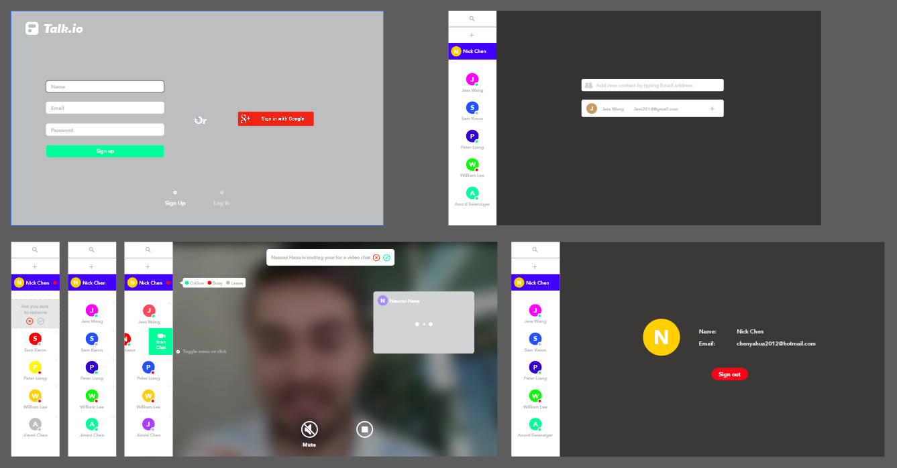

# talk.io

## App Screen Shoot

## Why Create?
The beauty of online chat app provides us an instant way to communicate. But, what is the real power under the hood which supports this great tech?

## Description
Talk.io is an instant online chat page by using webrtc tech.

## Key features
(1). Signup/Login/Logout 
(2). Google authentication 
(3). Change login users status 
(4). Add friend/Delete friend 
(5). Search existed friend list 
(6). Invite friend for video chat 
(7). Draggable chat window 
(8). Mute/End call 
